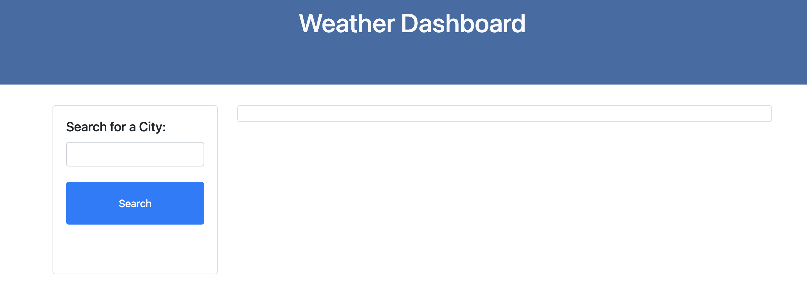
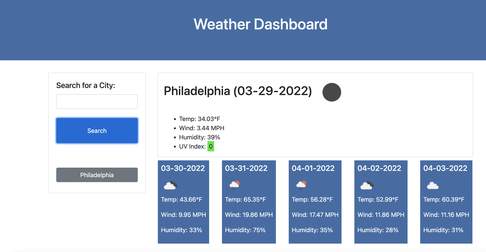
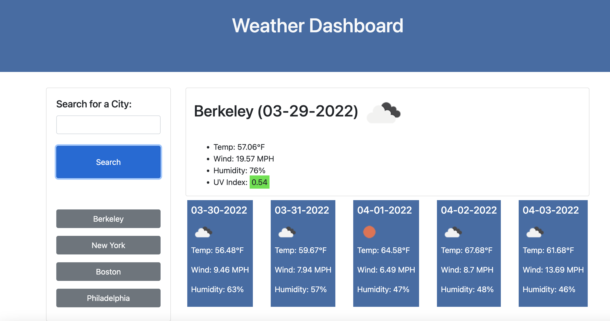

# Weather Dashboard

## Description

This application allows you to search for a city and return the current and future weather conditions of that city from the Open Weather API

### What I learned
In the process of creating this project I learned how to perform API calls on server-side APIs while using the Open Weather API.

## Usage

The webpage can be found at [this link](https://carol-tsai.github.io/weather-dashboard/)

When you arrive at this page, the panel on the right side of the page will have a search bar where you can search for a city.

When you enter a city and click search, that city will appear in the search history under the search bar, and the current weather as well as the 5 day forecast will be displayed for that city. The UVI index will have a background color that indicates good, moderate, or bad UV conditions, which can inform you of the level of sun protection needed currently.

The cities that you search will be stored in local storage and displayed on the right hand panel. You can click on cities in your search history to see updated weather for those cities.

## Credits

Cirriculum and materials for the UPenn LPS Coding Bootcamp was referenced in the creation of this application.

Weather information in this application is from the Open Weather API

## How to Contribute
Please reach out to me at carol.tsai0224@gmail.com if you would like to contribute to this project.

## License

MIT License

Copyright (c) 2022 Carol Tsai

Permission is hereby granted, free of charge, to any person obtaining a copy
of this software and associated documentation files (the "Software"), to deal
in the Software without restriction, including without limitation the rights
to use, copy, modify, merge, publish, distribute, sublicense, and/or sell
copies of the Software, and to permit persons to whom the Software is
furnished to do so, subject to the following conditions:

The above copyright notice and this permission notice shall be included in all
copies or substantial portions of the Software.

THE SOFTWARE IS PROVIDED "AS IS", WITHOUT WARRANTY OF ANY KIND, EXPRESS OR
IMPLIED, INCLUDING BUT NOT LIMITED TO THE WARRANTIES OF MERCHANTABILITY,
FITNESS FOR A PARTICULAR PURPOSE AND NONINFRINGEMENT. IN NO EVENT SHALL THE
AUTHORS OR COPYRIGHT HOLDERS BE LIABLE FOR ANY CLAIM, DAMAGES OR OTHER
LIABILITY, WHETHER IN AN ACTION OF CONTRACT, TORT OR OTHERWISE, ARISING FROM,
OUT OF OR IN CONNECTION WITH THE SOFTWARE OR THE USE OR OTHER DEALINGS IN THE
SOFTWARE.